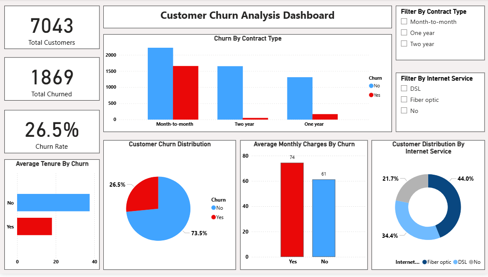

# Customer Churn Analysis

## 📌 Project Overview

Customer churn is a critical problem for telecom companies, as losing customers directly impacts revenue.
This project focuses on analyzing customer behavior to identify patterns and key factors that lead to churn.

The analysis is performed using **Python, SQL, and Power BI**, and the insights are presented through an interactive dashboard.

---

## 🎯 Objectives

* Understand customer behavior and churn patterns
* Identify key factors influencing customer churn
* Provide actionable business recommendations to improve customer retention
* Build an interactive dashboard for easy visualization of insights

---

## 🛠️ Tools & Technologies Used

* **Python** → Data cleaning, preprocessing, and analysis
* **SQL (MySQL)** → Data querying and aggregation
* **Power BI** → Interactive dashboard and visualization

---

## 📊 Dataset Information

The dataset contains customer details such as:

* Demographics (gender, senior citizen, dependents)
* Account information (tenure, contract type, payment method)
* Services used (internet service, streaming, security, etc.)
* Charges (monthly charges, total charges)
* Target variable: **Churn (Yes/No)**

---

## 📈 Key Business Insights

### 🔹 1. Contract Type Has the Strongest Impact

Customers with **month-to-month contracts** have the highest churn rate, while customers with **long-term contracts (1 year / 2 year)** tend to stay.

👉 **Insight:** Short-term commitment increases the risk of churn.

---

### 🔹 2. High Monthly Charges Lead to Higher Churn

Customers who churn are paying **higher monthly charges** compared to those who stay.

👉 **Insight:** Pricing plays a crucial role in customer retention.

---

### 🔹 3. New Customers Are More Likely to Leave

Customers with **low tenure** (new customers) have a higher churn rate.

👉 **Insight:** Early customer experience is critical.

---

### 🔹 4. Internet Service Type Influences Churn

Customers using **fiber optic internet** show higher churn compared to DSL or no internet service.

👉 **Insight:** Service quality or pricing might be affecting customer satisfaction.

---

### 🔹 5. Overall Churn Rate

Approximately **26% of customers have churned**, which indicates a significant retention issue.

---

## 📊 Dashboard Preview

---

## 📂 Project Structure

* `data/` → Dataset used for analysis
* `notebooks/` → Python analysis and preprocessing
* `sql/` → SQL queries for data analysis
* `dashboard/` → Power BI dashboard and screenshots

---

## 💡 Business Recommendations

* Encourage customers to opt for **long-term contracts** through offers or discounts
* Review pricing strategies for **high-paying customers**
* Improve onboarding experience to retain **new customers**
* Analyze and improve services for **fiber optic users**

---

## 🚀 Conclusion

This project demonstrates how data analytics can be used to extract meaningful insights and support business decision-making.
By identifying key churn drivers, businesses can take proactive steps to improve customer retention and reduce revenue loss.

---

